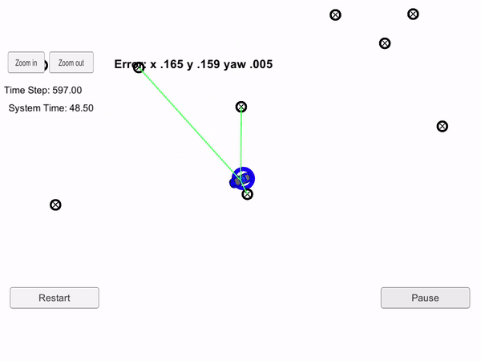

# CarND-Kidnapped-Vehicle-Project

[image1]: ./results/result.png "result Image"
[image2]: ./results/algo.png "algo Image"
[image3]: ./results/example_trasfor.png "example_trasfor Image"
[image4]: ./results/formula_1.png "formula_1 Image"
[image5]: ./results/homo_transformation.png "homo_transformation Image"
[image6]: ./results/multivariate_gaus.png "multivariate_gaus Image"

This repository contains C++ code for implementation of Particle Filter to localize a vehicle kidnapped in a closed environment. 

## Project Goal

In this project, a vehicle is kidnapped inside a closed environment and has no idea of its location. This environment is simulated in [Udacity's self driving car simulator](https://github.com/udacity/self-driving-car-sim/releases). The vehicle travels through the environment and takes roughly 2400 steps with change in orientation and position. The goal is to predict the location of vehicle using Particle Filter program implemented in C++. The error between ground truth location of robot and the predicted location should be minimal. Also, the program must be performant enough to run within 100 seconds while maintaining minimal error.

## Background

Localization is to predict the location of a vehicle with a high accuracy in the range 3-10 cm. This location is in reference to a global map of the locality in which the self driving vehicle is either stationery or moving.

One way to localize a vehicle is to use data from Global Positioning System (GPS), which makes use of triangulation to predict the position of an object. But GPS doesn't always provide high accuracy data. For e.g.: In case of a strong GPS signal, the accuracy in location could be in the range of 1-3 m. Whereas in the case of a weak GPS signal, the accuracy drops to a range of 10-50 m. Hence the use of only GPS is not reliable.

To achieve an accuracy of 3-10 cm, sensor information from various sensors such as Laser sensors (LIDAR), Radial distance and angle sensor (RADAR) are fused together using the Particle Filter.

## Project Implementation

An overview of the algorithm is illustrated in the following diagram:
![alt text][image2]

The C++ program for localization was implemented using the following major steps:

#### Initialization:
* The number of particles are defined.
* All particles are initialized using GPS measurements with mean equal to the location received from GPS and standard deviation equal to the GPS measurement uncertainty.
* Initial weight of all particles is set to one.
 
#### Prediction:
  
* The location of each particle at the next time step 'delta_t' is predicted using the following formulae:
![alt text][image4] 
  
 #### Update Weights:
 
 * The vehicle uses LIDAR to sense its distance from landmarks and predict the location of landmarks as observed. This is received as a list of x, y coordinates along with the noise mapped as standard deviation in X (σx) and Y (σy) axes. Since, the LIDAR sensor is installed on the robot, these observations are received in x, y coordinate axes relative to the direction of motion of vehicle.
 * These observation measurements are transformed from the vehicle co-ordinates to map co-ordinates using the following transformation matrix. 

![alt text][image5] 

* For every observation measurement the nearest landmark [x, y] coordinates are found. This is done by finding a landmark with lowest Euclidean distance associated to the observation. 
* For every observation measurement the multivariate Gaussian normal distribution with its closest landmark is calculated and all resulting probabilities are multiplied.

![alt text][image6] 

* The resulting probabilities are weights of the particles. 
*  The weight of particle is the measure of how close the particle is w.r.t. to the ground truth of vehicle. The higher the weight, the more accurate is the particle's prediction. Hence, at the end of each update step, 'resampling' of particles with replacement is done to remove highly improbable particles.   

#### Resampling: 
* Resampling involves retaining of particles with higher weight and crushing of particles with lower weight. Once resampling is done, the particle with highest weight is chosen. This particle gives most accurate prediction of vehicle's location.
   
* The location provided by particle with highest weight is then compared with the ground truth and error in the system is calculated.

## Installation:

### Windows:
* [step by step guide](https://medium.com/@fzubair/udacity-carnd-term2-visual-studio-2015-17-setup-cca602e0b1cd)

* One of the newest features to Windows 10 users is an Ubuntu Bash environment that works great and is easy to setup and use. Here is a nice [step by step guide](https://www.howtogeek.com/249966/how-to-install-and-use-the-linux-bash-shell-on-windows-10/) for setting up utilities.

### Ubuntu:

* Execute every step from ./install-ubuntu.sh. This will install gcc, g++, cmake, make and uWebsocketIO API.  
*  Build and run project by running ./build.sh.  
* In case of error, manually build the project and run using:
** mkdir build && cd build
** cmake ..
** make
** ./particle_filter    
* Run the Udacity simulator and check the results
  
 ## Results 
![alt text][image1]
